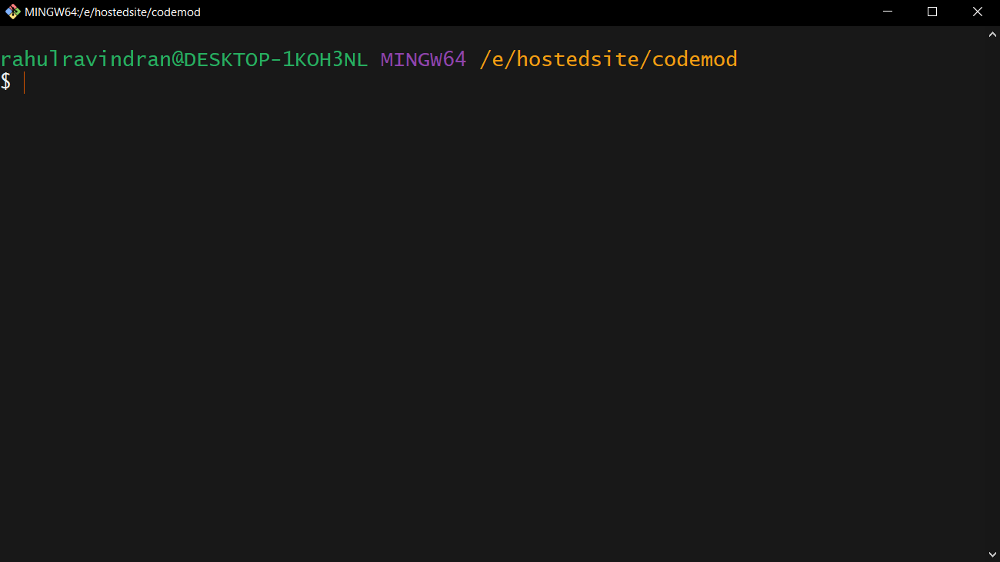
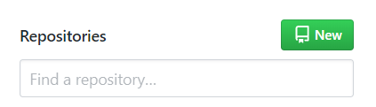
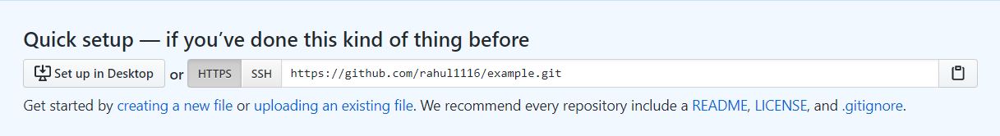

# Downloading latest Bot version & setting up git

## 👇 Prerequisites

1. Git installed on your machine. Download from [here](https://git-scm.com/downloads)

## Steps

1. Download the **ZIP** from the [repository](https://github.com/rahul1116/codemod)


2. Extract the zip and change directory **CodeMod**
3. Open git bash in the root directory



4. **Configuring Git and GitHub**

    - Login to your GitHub account. Don't have an account? [Create one](https://github.com)

    - Make a [new repository](https://github.com/new)

        

    - Name your repo and create new repository

        


    - In the **Git Bash** initialize git repository
        ```terminal
            git init
        ```
    - Add all the files to staging area
        ```terminal
            git add .
        ```
    - Committing all the staged files
        ```terminal
            git commit -m "Initial commit"
        ```
    - Adding origin to the local repository [Paste the repo URL we copied from the remote repository]
      

        ```terminal
            git remote add origin <your-repo-url>
        ```

    - Pushing code to remote repository
        ```terminal
           git push -u origin <branch-name>
        ```
